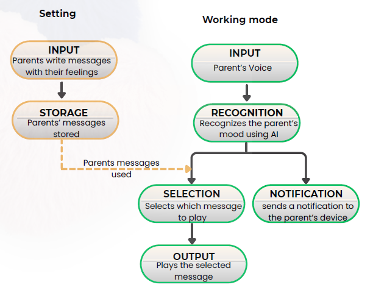

# 仕様概要（MVP）

　本アプリの使用にあたり、親は子どもとのコミュニケーションにおいて、どのようなときにうまく気持ちが伝わらないか記録する。その上で、どのような言葉を子どもにかけてあげれば、彼らがうまく親の状況を理解できるように思われるのか、「子どもにかけるべき言葉」をテクストとして複数記録しておく（INPUT,STORAGE）。
　その上で本システムは、親子間会話において、親の発言（内容および声色など）から親の置かれた状況を自動で検出する（INPUT,RECOGNITION）。そして、あらかじめ記録されたメッセージから、その状況にふさわしいものを自動で選択し(SELECTION)、子ども用のデバイスから音声を生成・再生する(OUTPUT)。同時に、選択されたメッセージを親のデバイスにも通知する（NOTIFICATION）。
　これらの機能により、このシステムは、子どもは親の背景情報を理解し、また、親は自分が置かれた状況を客観的に把握することを助ける。

## 目的
本MVPでは、機能のイメージをプレゼンするための最低限の仕様を実装する。
- RECOGNITION、SELECTION、OUTPUT、NOTIFICATIONは非スコープとし、ダミー画面で代替する。
  - SELECTIONされるメッセージはハードコーディングする。（どの入力に対しても同じメッセージを返す）
- INPUT、STORAGEのうち、親が子どもにかけるべき言葉（テキスト）の登録は非スコープとし、動画/音声ファイルまたはテキスト入力の送信のみを実装する。
  - 親が子どもにかけるべき言葉（テキスト）の登録内容はdocs\developer_guide\unit\parent_child_mock_cases.csvの内容をハードコーディングする。

## 画面構成
./unit以下の画面設計を参照。

## 入力仕様（MVP）
- 動画/音声ファイルのアップロードと、テキストの直接入力の両方に対応する。
- 動画/音声とテキストは「どちらか片方のみ」でも送信できる。
- 入力ファイルはスマホ（iPhone/Android）で録音・録画したものを想定し、スマホブラウザから選択して送信する。

## 制約（MVP）
- 動画/音声の長さ上限: 2分
- 動画/音声の最大ファイルサイズ: 300MB
- 許可形式（拡張子/Content-Type）
  - 動画: `.mp4`（`video/mp4`）、`.mov`（`video/quicktime`）、`.3gp`（`video/3gpp`）
  - 音声: `.m4a`（`audio/mp4`）、`.aac`（`audio/aac`）
- テキスト入力の最大文字数: 10,000文字

## データ保持（TTL）
- アップロードされた入力（動画/音声/テキスト）およびメタデータは1週間保持し、期限後は自動削除する。
  - 自動削除はベストエフォートとし、削除タイミングに多少の遅延が生じうる。